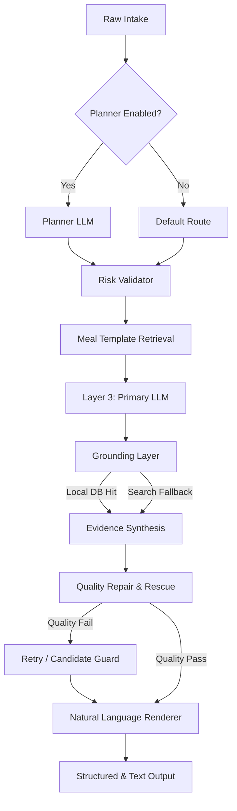

# Text Meal Canary: 全系統架構、權責與可觀測指標藍圖

## 專案定位與核心原則
本文件定義 `Text Meal Canary` 的系統架構與操作規、，旨在確保系統在模型升級（Frontier Model Upgrade）過程中保持長期的產品價值與技術債防禦。

### 核心導軌 (依據 agent.md)
- **LLM-first**: 優先信任強大模型的語意理解能力，確定性程式碼（Deterministic Code）僅用於校準、驗證與路由。
- **Durable Architecture**: 建立在模型進步後依然有價值的資產（如：精確結構化數據、特定的安全護欄）。
- **Frictionless**: 追求低互動成本，優先提供合裡的 Baseline 而非強制追問。

---

## 系統架構流程 (Pipeline)

### 階段定義
1.  **Raw Intake**: 捕捉原始用戶輸入（文字、圖片、環境參數），保留所有意圖相關上下文。
2.  **Planner**: 負責意圖識別、路由分發、缺失片段識別與上下文理解。
3.  **Risk Validator**: 識別高風險家族（如：自助餐、宴席、家常菜），發送必要的驗證標誌。
4.  **Meal Template**: 檢索對應的餐型架構（如：便當、滷味），提供結構化先驗（Priors）。
5.  **Primary LLM**: 負責核心估算、不確定性建模、追問決策與追問質量。
6.  **Grounding Layer**: 擁有本地精確庫（Exact Item）、基礎營養庫（Base Nutrition）以及可選的搜索 Fallback。
7.  **Repair & Rescue**: 確定性程式碼層，負責格式驗證、Zero-Kcal 保護、備選方案篩選與 Retry 控制。
8.  **Renderer**: 將結構化結果組合成自然語言，面向用戶輸出。

---

## 權責分配 (Division of Labor)

| 類別 | LLM (Layer 3 / Planner) | 確定性程式碼 (Deterministic) |
| :--- | :--- | :--- |
| **食物理解** | 泛化食物理解、成分拆解、組成推理 | Schema 驗證、格式解析 |
| **熱量估算** | 模糊 Baseline 估算、份量推理 | 精確品項查表、TFDA 真值對接 |
| **品質控制** | 檢測自身不確定性、生成追問 | 觸發 Retry 門檻、Zero-Kcal 攔截 |
| **證據融合** | 綜合外部資訊進行推理 | 證據來源排序（P0 > P1 > P2）、身份保護 |
| **路由決策** | 語意路由判斷 | 預定義安全風險路由 |

---

## 追蹤合約 (Trace Contract)
為了實現精確的**錯誤歸因 (Failure Attribution)**，系統必須捕捉以下核心 Trace 字段：

| 階段 | 關鍵字段 | 用途 |
| :--- | :--- | :--- |
| **Intake** | `raw_input_bundle` | 保留原始現場，用於 Debug |
| **Planning** | `planner_output`, `route_family` | 判定路由是否正確 |
| **Risk** | `risk_flags`, `required_checks` | 判定風險攔截是否精準 |
| **Estimation** | `primary_llm_output`, `top_uncertainty_drivers` | 追蹤模型估算邏輯與不確定性來源 |
| **Grounding** | `db_hit_type`, `grounding_summary`, `match_confidence` | 評估本地數據庫覆蓋率與精準度 |
| **Repair** | `rescue_applied`, `retry_triggered`, `failed_layer` | 標註系統在哪一層發生崩潰或修復 |

---

## 安全護欄與品質門檻 (Guardrails)

> [!IMPORTANT]
> **Identity Protection (身份保護)**: 特定品項（Specific Item）的優先級高於寬泛模板（Broad Template）。嚴禁將「五十嵐」的精確數據被「手搖飲」模板覆蓋。

> [!CAUTION]
> **Zero-Kcal Guard (零熱量防禦)**: 除非輸入內容完全不包含食物資訊，否則系統必須輸出非零的 Baseline。若已有非零候選答案，嚴禁被後續步驟的空結果覆蓋。

---

## 可觀測性與評估指標

### 1. 系統健康度
- **Success Rate @ Benchmark**: 在固定測試集上的熱量偏差比率（±20%）。
- **Zero-Kcal Rate**: 異常輸出零熱量的比例。
- **Retry Rate**: 系統觸發自動修復的頻率。

### 2. 資料庫質量
- **Local DB Hit Rate**: 用戶輸入命中本地精確庫的比例。
- **Search Success Rate**: 搜索 Fallback 成功找到 P0/P1 證據的比例。

### 3. 互動品質
- **Follow-up Precision**: 追問問題是否有效降低了 `top_uncertainty_drivers` 的影響。
- **Uncertainty Calibration**: 模型表達的不確定性與實際偏差的正相關程度。
